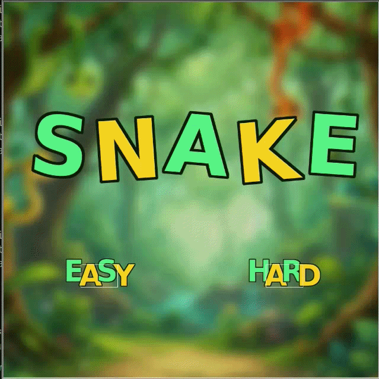

# Snake Game

This is a Snake game made with Python using Turtle and Pygame.

I originally created this project as a prototype to learn the basics of game development and Python. After getting the first version working, I continued developing it by adding different features and improving the game.

## Features

* Easy and Hard modes
* Snake movement with arrow keys
* Food and snake growth
* Score and high score
* 3 lives
* Game Over system
* Sound effects and background music
* Custom backgrounds and graphics
* Collision with walls and the snake's body

## Technologies

* Python
* Turtle
* Pygame

## Controls

* Up Arrow: Move up
* Down Arrow: Move down
* Left Arrow: Move left
* Right Arrow: Move right

## About the project

The first version was mainly a prototype to understand how a simple game works. I then developed it further by adding the menu, difficulty levels, sounds, lives and other elements.

The project is still a prototype and can be improved with more features in the future.

## How to run

Install Pygame:

```bash
pip install pygame
```

Then run the main Python file:

```bash
python3 snake2.py
```

## DEMO


